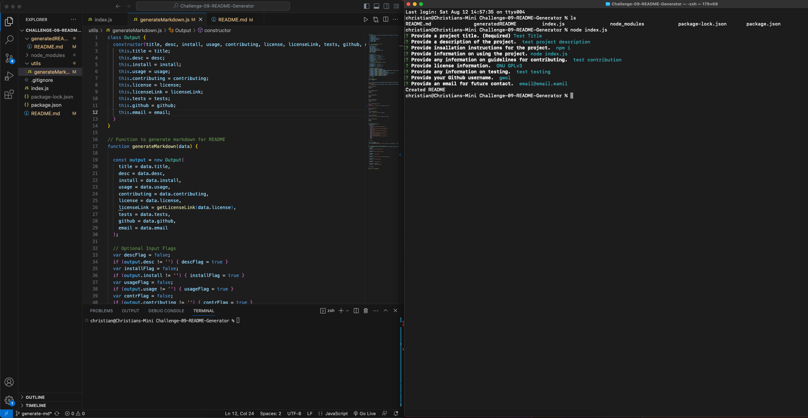

# Challenge-09 README.md Generator

## Description 
  Dyanamically creates a README.md file that takes in multiple user inputs to create the document. A user can leave an input blank to skip a section of the README that thye do not want to include. 

## Table of Contents
  
  - [Description](#description)
  - [Installation](#installation)
  - [Usage](#usage)
  - [License](#license)
  - [Testing](#testing)
  - [Questions](#questions)

## Installation
  Have Node installed 
  Run in terminal 'npm i'

## Usage
  In a terminal, input 'node index.js' in the application directory

## License
  This application is licensed under the [MIT](https://choosealicense.com/licenses/mit/) license
  
## Testing
  In the folder generatedREADME is a README.md that was generated with the application
  
  
## Questions
  Created by: [cgwol](https://github.com/cgwol/)
  
  Contact with any further questions at [cgwalterson@icloud.com](mailto:cgwalterson@icloud.com)
  